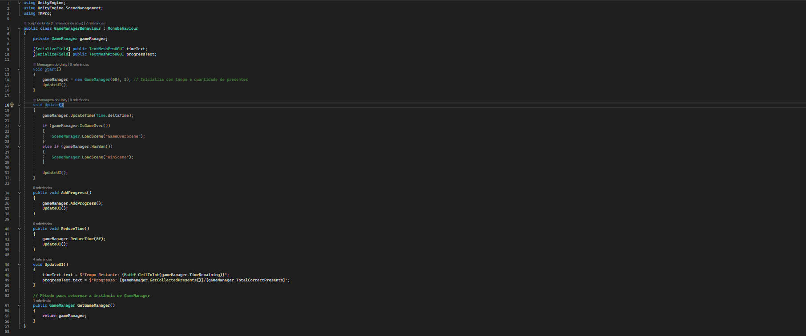

# **Salvando o Natal do Grinch**

## **Descrição do Projeto**
"Salvando o Natal do Grinch" é um jogo desenvolvido para repor notas das disciplinas **POO**, **LP**, e **TDDGA**, devido a dificuldades pessoais enfrentadas por mim, **Bruno Santos Ichikawa**. Inspirado no filme *O Grinch* (2000), o jogo oferece uma experiência divertida e desafiadora, transportando os jogadores para uma aventura natalina.

## **Público-Alvo**
O jogo é ideal para pessoas que assistiram e gostaram do filme *O Grinch* (2000) e que apreciam desafios rápidos e casuais.

## **História do Filme**
O jogo é inspirado no filme *O Grinch* (2000), onde o Grinch tenta roubar o Natal da cidade de Whoville, mas acaba aprendendo o verdadeiro significado dessa celebração ao interagir com os habitantes.

## **Teoria das Cores**
As escolhas de cores no jogo foram feitas para reforçar os temas natalinos e o contraste entre o "bem" e o "mal":

- **Grinch**: Verde vibrante, representando o personagem icônico. Essa cor é associada ao espírito travesso do Grinch.
- **Cena Principal**: Paleta de cores quentes (vermelho, dourado) e neutras (branco, cinza), criando uma atmosfera acolhedora e festiva.
- **Player**: Verde e vermelho, cores tradicionais do Natal, reforçando a ideia de que o jogador está "salvando" o Natal.
- **Presente Certo/Espírito de Natal**: Vermelho e dourado, cores associadas a alegria, celebração e felicidade.
- **Presente Errado/Espírito Grinch**: Roxo e preto, transmitindo uma sensação de perigo e indicando um elemento negativo.

## **Telas do Jogo**

### **Menu Principal (MenuScene)**
- Permite iniciar o jogo, visualizar os créditos ou sair.
- Design simples com tema natalino, usando cores quentes e a música tema do Grinch filme *O Grinch*.

### **Jogo (GameScene)**
- Ambiente interativo com presentes espalhados pelo mapa.
- O jogador deve coletar presentes corretos/Espírito de Natal e evitar os incorretos/Espírito Grinch.
- **Balão de fala**: 
  > "HAHAHA. Não acredito que consegui... eu quebrei o espirito de natal. Ninguém consegira restaura-lo... a menos que alguem junte todas as partes. Mas duvido que conseguiriam."

### **Cena de Vitória (WinScene)**
- **Imagem**: O Grinch cortando um pedaço de assado para uma criança enquanto sorri.
- **Balão de fala**: 
  > "Eu finalmente entendi... O Natal não vem de uma loja. Não é sobre presentes ou enfeites. É sobre estarmos juntos, celebrando o que realmente importa: o amor, a amizade e a alegria de compartilhar momentos. Quem diria que um Grinch como eu aprenderia isso? Agora, passem o assado. Temos muito a comemorar!"
  

### **Cena de Derrota (GameOverScene)**
- **Imagem**: O Grinch cortando um pedaço de assado com um sorriso maléfico.
- **Balão de fala**: 
  > "Eu sabia! Sem os enfeites, sem os presentes, sem a comida... o Natal desmorona como uma árvore sem raízes. Você falhou, e agora eles saberão como é viver sem essa tolice toda. Talvez no próximo ano você entenda... ou talvez nem o Natal seja suficiente para ensinar a todos o verdadeiro significado."
  

### **Créditos (CreditsScene)**
- Lista de todos os recursos utilizados e agradecimentos.

## **Como Jogar**
1. Utilize as teclas **WASD** para se movimentar e o **mouse** para ajustar a direção.
2. Interaja com os presentes corretos/Espírito de Natal espalhados pelo mapa.
3. Evite os presentes errados/Espírito Grinch, que diminuem o tempo restante em **5 segundos**.
4. Colete todos os presentes corretos para vencer o jogo!

## **Diagrama de Classe**

## **Códigos**

- ### **MenuManager** 
- ### **MenuManagerBehaviour** 
- ### **Present** 
- ### **PresentBehaviour** 
- ### **GameManager** 
- ### **GameManagerBehaviour** 
- ### **movimento** 
- ### **movimentoBehaviour** 

## **Músicas e Sons**
- **Menu**: Trecho da trilha sonora original do filme *O Grinch*.
- **Durante o Jogo**: Versão personalizada da música "PigStep" por *Aaron Grooves*.
- **Derrota**: Música de derrota de *Left 4 Dead 2*.
- **Vitória**: Hollow Knight ~ Merry Christmas ~ Instrumental por *Mimir :3*.

## **Modelos Utilizados**
- **Grinch**: [Nintendo Switch - The Grinch Christmas Adventure](https://sketchfab.com/3d-models/nintendo-switch-the-grinch-christmas-adventure-72963512a016407faa3f3d8879d6545e)
- **Cena Principal**: [Christmas Low Poly Scene](https://sketchfab.com/3d-models/christmas-low-poly-scene-7984bd6024db4b89928ddeb625eebac0)
- **Player**: [Christmas Elf](https://sketchfab.com/3d-models/christmas-elf-b4dcf459298b43f19ccef6a999ca88ac)
- **Presente Certo/Espírito de Natal**: [Christmas Present](https://sketchfab.com/3d-models/christmas-present-2d8bf19f134e4219b542d52304b80728)
- **Presente Errado/Espírito Grinch**: [Gift Box](https://sketchfab.com/3d-models/gift-box-33bb8031d7ac40758575835cec277761)

## **Créditos**
- **Desenvolvimento**: Bruno Santos Ichikawa.
- **Modelos 3D**: Recursos gratuitos da internet (links na seção Recursos Utilizados).
- **Músicas**: Créditos conforme listados na seção "Músicas e Sons".
